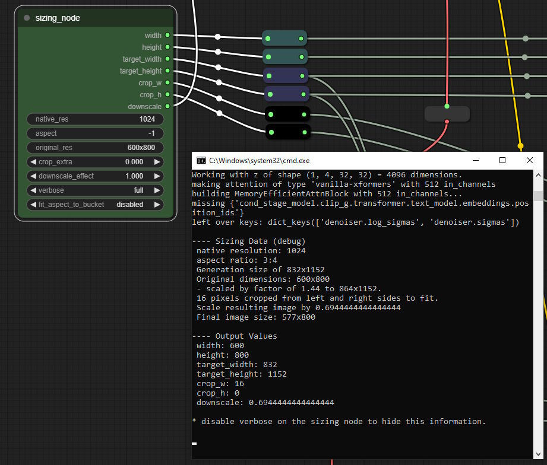

## Automatic Sizing for SDXL

This is a little node I wrote for myself for [ComfyUI](https://github.com/comfyanonymous/ComfyUI). Just clone this repo into your custom nodes folder.

Don't fuss about the downscale thing, it's optional.

### What it does, for the layman

If you're wondering _Why shouldn't I just set my width, height, etc, to 4096? That's what they said to do on Reddit,_ then I'm not going to try to change your mind. I would recommend reading the [SDXL Report](https://arxiv.org/pdf/2307.01952.pdf), specifically the section where they talk about the new conditioning parameters. But this node was made primarily for people who already know why they might want to put a different value into those fields.

SDXL takes six new inputs for its prompt conditioning, or three * two dimensions (width and height); plus there's the two you already had—the width and height you generate at. These are all a bit funny to figure out yourself. You could keep a copy of StabilityAI's list of bucketed resolutions for training and use this to get your latent generator sizes, but they're basically just a series of resolutions where the width and height are multiples of 64, they multiply together to something close to 1024², and their aspect ratio is between 1:4 and 4:1. Instead of memorizing these, with this widget you can just input "1024" and any aspect ratio you like, and you'll get the closest one that fits that description. (You can exceed 4:1, however, if you really want to...)

And then there's the cropping. If you have an original image dimension and a training dimension after scaling, the amount cropped from one dimension will be rigidly determined by the difference between the scaled image and the training dimensions. And I checked their documentation to be sure that they get this number 1. _after_ scaling to the training dimensions, and 2. from the left edge and the top edge only, so that seemed like enough information to determine what these numbers should be. So this widget figures that out and gives it as your crop_w and crop_h outputs. Optionally you can add more cropping with _cropping_extra_, if that's something you want. (Sometimes it is.)

So with three inputs, one of which doesn't usually need to change (_native_res_), you can get all your relevant sizing numbers: width, height, crop_w, crop_h, target_width, target_height, and the width and height of your empty latent generator. I think that's simpler.

If you're not sure what these conditioning inputs do they're explained here (with the exception of target_width/target_height):  
https://arxiv.org/pdf/2307.01952.pdf

 ### The old Readme.md

This node takes native resolution, aspect ratio, and original resolution. It uses these to calculate and output the generation dimensions in an appropriate bucketed resolution with 64-multiples for each side (which double as the target_height/\_width), the resolution for the **width** and **height** conditioning inputs (representing a hypothetical "original" image in the training data), and the **crop_w** and **crop_h** conditioning inputs, which are determined by the difference between the model resolution and the upscaled/downscaled training image along that dimension (and divided by two). The downscale output can optionally be connected to an "upscale by" node to automatically downscale gens to match the "original size" set in this node. (Most don't like downscaling, this was for my own use.) Set to 0.0 or just don't connect the output to anything if you don't want downscaling.

The input fields accept different kinds of string inputs to produce different results:

**"native_res"**  
- "1000x10" - returns 100, the square root of 10 * 1000 (as an int).  
- "100" - returns 100  
- "100.0" - returns 100

(this should generally be left at **1024** for SDXL.)  

**"aspect"**  
these are all correct ways of getting a 1:2 aspect ratio:
- "2:4"  
- "1x2"  
- "0.5"  
- "1 by 2"

you can also enter -1 to get the aspect from the original resolution, if it is given as two dimensions. e.g. "1920x1080" for _original_resolution_ and "-1" for _aspect_ would give an aspect ratio of 16/9, or ~1.78

**"original_res"**  
- "600" - returns 600 on the long side, and the short side is calculated to match the aspect ratio.  
- "600x600" - returns 600 by 600, and crop_w and crop_h are calculated accordingly if this doesn't match the aspect ratio of the image resolution. (This can result in large crop values.)
- "2.0" - returns dimensions double those of the generation. e.g. if you're generating at 1024x1024, this will return 2048x2048. 

### The other inputs?

**extra_crop** adds some extra to the crop_w and crop_h as a proportion of the generation size. In my experience this usually looks pretty odd, if you use it at all the number should be kept low. Generally you'll leave this at 0.0. It will also increase downscaling because it makes for a smaller 'theoretical' final image size. I'm not really sure that this works all that well, but it's there if you want it.

**downscale_effect** determines how much to adjust the "downscale" output to match the 'original resolution' (minus cropping). At 1.0 it matches original resolution exactly (minus cropping), at 0.5 it's midway between that and your gen size, etc.

**verbose** enables reporting on the outputs in the console so you can see what it's doing. Full gives a fuller explanation, basic just gives the outputs.

**fit_aspect_to_bucket** adjusts your aspect ratio after determining the bucketed resolution to match that resolution so that crop_w and crop_h should end up either 0 or very nearly 0.

**strict_bucketing** matches your gen size to one of the bucket sizes explicitly given in the SDXL report (or to those recommended by the ComfyUI developer). Most inputs will match one of the buckets given in the report anyway, because of how this node calculates the dimensions for the latent. But there are a few sizes that my node will output which aren't explicitly listed as bucketed training resolutions, so in those cases this will pick a close training bucket instead.

The string input at the bottom of the advanced node accepts some further arguments which are too niche to deserve a full input of their own. Some examples:
- **--nudge w 0.8** will yield an original resolution which would have 80% of the maximum plausible cropping on the width dimension. This is for testing resolutions at the limits of plausible crop_w/crop_h values.
- **--randomaspect** will give a randomized aspect ratio, rather than a standard one. Unfortunately this will not be randomized with each generation, I'd have to figure out how to make ComfyUI invoke the node once per batch. This optionally accepts two arguments, e.g. **--randomaspect 2x3 4x2**, for minimum and maximum. If not given it will default to 0.25 and 4.0. Inputs can be given as 1/2, 1:2, 0.5, 1x2, or 1*2.
- **--nocrop** sets crop_w and crop_h outputs to 0. This is less work than disconnecting the crop outputs, and may be useful for A/B testing whether 'plausible' crop values produce worse images than leaving them 0.

More arguments may be added in future.

### Postscript

If any of this is flat-out wrong, if I've misread the docs or just typed something in wrong or terribly misused Python in some basic way, please let me know. I've used this for a while with the verbose reporting turned on to check my numbers, so I'm pretty sure it's working for what I'm doing at least, but it might be broken in some way I haven't tested, or I might be missing something by not looking closely enough.

Also, thanks to the anon who informed me straight away that this didn't work when I uploaded it and made me figure out the whole \_\_init\_\_.py thing (only to then write a better, fuller one himself). 
